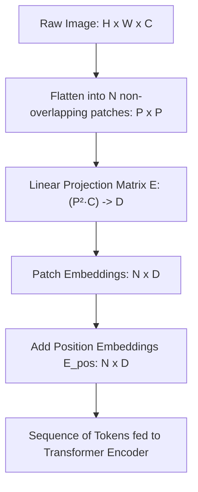
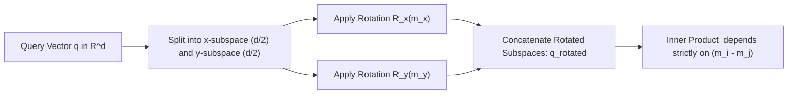
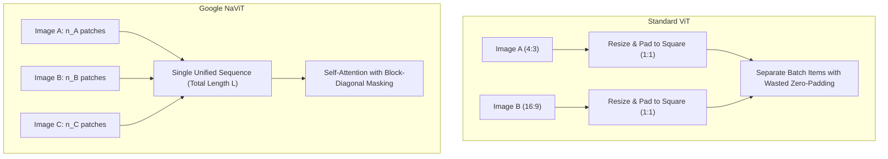
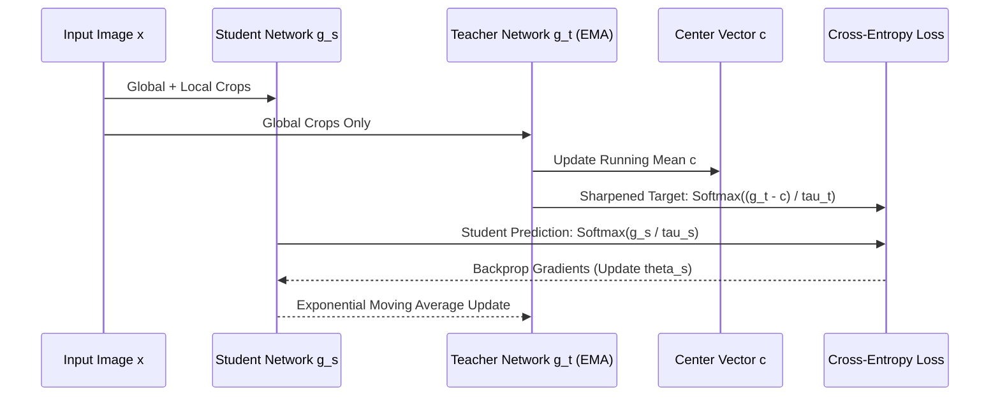
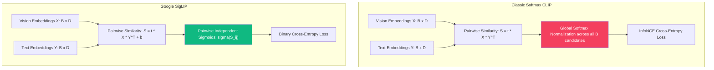
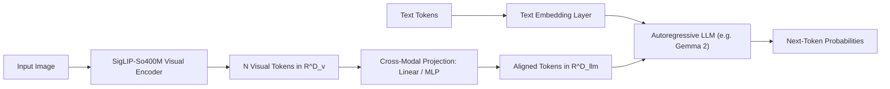

# The Math Behind Foundational Vision Models

## Introduction

Computer vision underwent a seismic shift over the last four years. We went from handcrafted convolutional inductive biases (spatial locality, translation equivariance) to massive, scale-driven foundational vision models. Models like ViT, DINOv2, Google's SigLIP, NaViT, and PaliGemma 2 do not process pixels the way classical vision algorithms did. They treat visual information as raw continuous tokens, optimize self-supervised energy landscapes, and align visual representations with language embeddings using statistical mechanics.

This post digs into the exact mathematical machinery under the hood of modern foundational vision models. We will break down patch projection geometry, 2D rotary position embeddings, the mathematics of self-distillation collapse prevention, and why Google's SigLIP formulation fundamentally broke the batch size ceiling that held back standard contrastive learning.

---

## 1. Spatial Tokenization: The Geometry of Patch Projections

A convolutional layer operates under two hard physical assumptions:
1. **Local connectivity:** Nearby pixels correlate far more strongly than distant pixels.
2. **Translation equivariance:** A feature detected at coordinate $(x, y)$ can be detected at $(x + \Delta x, y + \Delta y)$ using identical kernel weights.

Vision Transformers (ViT) throw away both assumptions at the architecture level and force the model to learn them from data.

### The Linear Projection Equation

Given an input image $\mathbf{X} \in \mathbb{R}^{H \times W \times C}$, where $H$ is height, $W$ is width, and $C$ is channel depth (typically 3 for RGB):

1. The image is segmented into non-overlapping patches of spatial dimension $P \times P$.
2. The total sequence length $N$ (number of patch tokens) is given by:

$$N = \frac{H \cdot W}{P^2}$$

3. Each patch $\mathbf{x}_p^{(i)}$ is flattened into a 1D vector of dimension $P^2 \cdot C$:

$$\mathbf{x}_p^{(i)} \in \mathbb{R}^{P^2 \cdot C}, \quad i \in \{1, \dots, N\}$$

4. The flattened vector is mapped into the transformer hidden dimension $D$ using a learnable projection matrix $\mathbf{E} \in \mathbb{R}^{(P^2 \cdot C) \times D}$ plus an optional bias $\mathbf{b}_e \in \mathbb{R}^D$:

$$\mathbf{z}_0 = \left[ \mathbf{x}_{\text{class}}; \ \mathbf{x}_p^{(1)}\mathbf{E}; \ \mathbf{x}_p^{(2)}\mathbf{E}; \ \dots; \ \mathbf{x}_p^{(N)}\mathbf{E} \right] + \mathbf{E}_{\text{pos}}$$

Where $\mathbf{x}_{\text{class}} \in \mathbb{R}^D$ is the prepended learnable `[CLS]` token, and $\mathbf{E}_{\text{pos}} \in \mathbb{R}^{(N + 1) \times D}$ represents the positional encoding matrix.

### Computational Complexity and the Quadratic Bottleneck

In multi-head self-attention (MHSA), queries $\mathbf{Q}$, keys $\mathbf{K}$, and values $\mathbf{V}$ are computed via projection matrices $\mathbf{W}_Q, \mathbf{W}_K, \mathbf{W}_V \in \mathbb{R}^{D \times D}$:

$$\mathbf{Q} = \mathbf{Z} \mathbf{W}_Q, \quad \mathbf{K} = \mathbf{Z} \mathbf{W}_K, \quad \mathbf{V} = \mathbf{Z} \mathbf{W}_V$$

The scaled dot-product attention equation is:

$$\text{Attention}(\mathbf{Q}, \mathbf{K}, \mathbf{V}) = \text{softmax}\left( \frac{\mathbf{Q}\mathbf{K}^\top}{\sqrt{d_k}} \right) \mathbf{V}$$

Let us analyze the computational FLOPs for sequence length $N$ and hidden dimension $D$:

* **Projection FLOPs:** Computing $\mathbf{Q}, \mathbf{K}, \mathbf{V}$ requires $3 \times (2 N D^2) = 6 N D^2$ floating point operations.
* **Attention Matrix $\mathbf{Q}\mathbf{K}^\top$:** Requires multiplying $(N \times D)$ with $(D \times N)$, which costs $2 N^2 D$ FLOPs.
* **Softmax and Scaling:** Costs approximately $3 N^2$ operations.
* **Context Aggregation $(\mathbf{A}\mathbf{V})$:** Multiplying $(N \times N)$ attention weights by $(N \times D)$ values costs $2 N^2 D$ FLOPs.
* **Output Projection:** Costs $2 N D^2$ FLOPs.

Total per-layer FLOPs roughly equal:

$$\text{FLOPs}_{\text{layer}} \approx 8 N D^2 + 4 N^2 D$$

Notice the dependency on patch size $P$. Because $N = \frac{HW}{P^2}$, halving the patch size (say from $P=16$ to $P=8$) quadruples $N$ ($N \to 4N$). Consequently:
* The $4 N^2 D$ term scales by a factor of $16$.
* Activation memory during training explodes by a factor of $16$.

This exact mathematical scaling barrier is why foundational vision backbones often freeze at $P=14$ or $P=16$ during pre-training, reserving $P=8$ strictly for dense downstream fine-tuning.

---

## 2. 2D Positional Geometry: From 1D Embeddings to 2D-RoPE

In NLP, sequence tokens follow a strict 1D temporal order ($t_1, t_2, t_3$). In computer vision, a 1D sequence mapping destroys crucial spatial geometry: patch $(i, j)$ has vertical neighbors $(i-1, j)$ and $(i+1, j)$ that are separated in the flattened 1D sequence by an arbitrary step length of $W/P$.

### 1D Absolute Learned vs Bicubic Interpolation

Early ViT used 1D learned vectors $\mathbf{e}_i \in \mathbb{R}^D$ added directly to the input tokens. When changing image resolutions during fine-tuning (for example, from $224 \times 224$ to $448 \times 448$), the sequence length grows from $14 \times 14 = 196$ to $28 \times 28 = 784$.

To reuse pre-trained positional embeddings, standard ViT performs 2D bicubic spline interpolation over the grid of learned embeddings:

$$\mathbf{E}_{\text{pos}}^{2D}(x, y) = \sum_{k=0}^3 \sum_{l=0}^3 a_{k, l} \, x^k y^l$$

While functional, this is an ad-hoc fix. The network learns positional relationships tied to specific coordinates rather than relative spatial displacements.

### 2D Rotary Position Embeddings (2D-RoPE)

Modern vision backbones adapt Rotary Position Embeddings (RoPE) to two dimensions. Instead of adding a vector to input embeddings, 2D-RoPE rotates query and key vectors in the complex plane according to their 2D grid coordinates $(m_x, m_y)$.

Let the attention head dimension be $d$. We split the channel dimensions into two equal halves of size $d/2$: one dedicated to the horizontal axis $x$, and one to the vertical axis $y$.

For coordinate $(m_x, m_y)$, the 2D rotary operator $\mathbf{R}_{(m_x, m_y)}$ is a block-diagonal matrix:

$$\mathbf{R}_{(m_x, m_y)} = \begin{pmatrix} \mathbf{R}_{m_x} & \mathbf{0} \\ \mathbf{0} & \mathbf{R}_{m_y} \end{pmatrix}$$

Where each sub-matrix $\mathbf{R}_{m}$ rotates consecutive 2D pairs by angle $m \theta_k$:

$$\mathbf{R}_m^{(k)} = \begin{pmatrix} \cos(m \theta_k) & -\sin(m \theta_k) \\ \sin(m \theta_k) & \cos(m \theta_k) \end{pmatrix}, \quad \theta_k = 10000^{-2(k-1)/d_s}$$

When computing the self-attention score between query $\mathbf{q}$ at position $\mathbf{u} = (u_x, u_y)$ and key $\mathbf{k}$ at position $\mathbf{v} = (v_x, v_y)$:

$$\langle \mathbf{R}_{\mathbf{u}} \mathbf{q}, \ \mathbf{R}_{\mathbf{v}} \mathbf{k} \rangle = (\mathbf{R}_{\mathbf{u}} \mathbf{q})^\top (\mathbf{R}_{\mathbf{v}} \mathbf{k}) = \mathbf{q}^\top \mathbf{R}_{\mathbf{u}}^\top \mathbf{R}_{\mathbf{v}} \mathbf{k} = \mathbf{q}^\top \mathbf{R}_{\mathbf{u} - \mathbf{v}} \mathbf{k}$$

Because rotation matrices form an orthogonal Lie group $\text{SO}(2)$ with the property $\mathbf{R}_\mathbf{u}^\top \mathbf{R}_\mathbf{v} = \mathbf{R}_{\mathbf{v} - \mathbf{u}} = \mathbf{R}_{-(\mathbf{u} - \mathbf{v})}$, the inner product depends exclusively on the relative spatial distance vector:

$$\Delta \mathbf{p} = (u_x - v_x, \ u_y - v_y)$$

This guarantees strict translation invariance across the 2D plane regardless of image resolution changes.

---

## 3. Google's NaViT: Patch 'n' Pack and Arbitrary Aspect Ratios

Standard vision architectures force every image into a fixed square aspect ratio ($1:1$, typically $224 \times 224$ or $384 \times 384$). This introduces two major problems:
1. **Geometric distortion:** Non-square inputs (e.g. panoramic $16:9$ or tall $9:16$) get squashed, altering natural object ratios.
2. **Computational waste:** Padding non-square inputs with zeros wastes up to 40% of attention FLOPs on empty border pixels.

Google Research introduced **NaViT (Native Resolution ViT)** to bypass square processing entirely through an algorithm called **Patch 'n' Pack**.

### The Patch 'n' Pack Mathematical Formulation

Instead of processing one image per batch slot, multiple images $I_1, I_2, \dots, I_K$ with varying resolutions and aspect ratios are tokenized into patch sets of lengths $n_1, n_2, \dots, n_K$.

These tokens are packed into a single continuous sequence of fixed length $L$:

$$\sum_{k=1}^K n_k \le L$$

Each patch token retains its true native 2D continuous coordinates $(x_i, y_i) \in [0, 1]^2$, normalized relative to the original image dimensions:

$$x_i = \frac{c_i \cdot P}{W_{\text{orig}}}, \quad y_i = \frac{r_i \cdot P}{H_{\text{orig}}}$$

To prevent cross-image information leakage within the shared sequence buffer, the self-attention affinity matrix is masked with an indicator function:

$$\mathbf{A}_{i, j} = \begin{cases} \frac{\mathbf{q}_i^\top \mathbf{k}_j}{\sqrt{d_k}} & \text{if } \text{img\_id}(i) = \text{img\_id}(j) \\ -\infty & \text{if } \text{img\_id}(i) \neq \text{img\_id}(j) \end{cases}$$

This transforms the dense $(L \times L)$ attention map into an exact block-diagonal matrix. Because self-attention is permutation-equivariant up to position embeddings, multiple images are processed concurrently inside a single forward pass with zero padding waste.

---

## 4. Self-Supervised Distillation: DINOv2 and Collapse Prevention

Supervised pre-training forces models to discard dense spatial details in favor of coarse label abstractions. Self-supervised visual representations preserve fine-grained semantic segmentation masks and localized patch similarities without a single human label.

The gold standard for self-supervised representation learning is **DINOv2 (Self-distillation with no labels)**.

### The Student-Teacher Framework

DINOv2 passes different augmented views of an image to two networks:
* **Student network** $g_{\theta_s}$: Receives global and local crops. Parameterized by weights $\theta_s$.
* **Teacher network** $g_{\theta_t}$: Receives global crops only. Parameterized by weights $\theta_t$.

The teacher weights are not updated via gradient descent. They follow an Exponential Moving Average (EMA) of the student parameters:

$$\theta_t \leftarrow \lambda \theta_t + (1 - \lambda) \theta_s, \quad \lambda \in [0.996, 1.0]$$

Both networks output a feature representation projected into a $K$-dimensional probability simplex using temperature-scaled softmax:

$$P_s(x)^{(k)} = \frac{\exp\left( g_{\theta_s}(x)^{(k)} / \tau_s \right)}{\sum_{j=1}^K \exp\left( g_{\theta_s}(x)^{(j)} / \tau_s \right)}$$

$$P_t(x)^{(k)} = \frac{\exp\left( (g_{\theta_t}(x)^{(k)} - c^{(k)}) / \tau_t \right)}{\sum_{j=1}^K \exp\left( (g_{\theta_t}(x)^{(j)} - c^{(j)}) / \tau_t \right)}$$

Where:
* $\tau_s, \tau_t$ are temperature scaling parameters ($\tau_t < \tau_s$, creating a sharpening effect on teacher outputs).
* $\mathbf{c} \in \mathbb{R}^K$ is a dynamic centering vector.

The learning objective minimizes the cross-entropy between student predictions and teacher targets:

$$\mathcal{L}_{\text{DINO}} = - \sum_{k=1}^K P_t(x)^{(k)} \log P_s(x)^{(k)}$$

### Mathematical Mechanics of Centering and Sharpening

In self-distillation without negative pairs, two degenerate failure modes exist:
1. **Mode Collapse (Uniform Output):** Output distributions become completely flat, maximizing entropy regardless of input.
2. **Dirac Collapse (One-Hot Collapse):** The model assigns 100% probability to a single fixed class token across all inputs.

DINOv2 prevents collapse through opposing mathematical forces:

* **Centering pushes toward uniform distribution:**
  Subtracting the running mean vector $\mathbf{c}$ prevents any single dimension from dominating the output space:

$$\mathbf{c} \leftarrow m \mathbf{c} + (1 - m) \frac{1}{B} \sum_{i=1}^B g_{\theta_t}(x_i)$$

  If dimension $k$ fires constantly across a batch, $c^{(k)}$ increases, which directly penalizes $g_{\theta_t}(x)^{(k)} - c^{(k)}$ in subsequent passes.

* **Sharpening pushes toward concentrated distribution:**
  Enforcing $\tau_t \ll \tau_s$ (e.g., $\tau_t = 0.04$ while $\tau_s = 0.1$) exponentiates dominant logit activations, preventing the distribution from decaying into a uniform blob.

The equilibrium between centering (entropy maximization) and sharpening (entropy minimization) stabilizes self-supervised training without requiring contrastive negative pairs.

### The KoLeo Regularizer: Preserving Dense Dimensional Entropy

To enforce uniform feature distribution across the embedding manifold and prevent patch representations from collapsing into a low-rank subspace, DINOv2 incorporates the **Kozachenko-Leonenko (KoLeo)** differential entropy estimator.

Given a batch of normalized vectors $\{\mathbf{z}_1, \dots, \mathbf{z}_n\}$, the KoLeo loss minimizes the log Euclidean distance between each vector and its nearest distinct neighbor:

$$\mathcal{L}_{\text{KoLeo}} = - \frac{1}{n} \sum_{i=1}^n \log \left( \min_{j \neq i} \| \mathbf{z}_i - \mathbf{z}_j \|_2 \right)$$

Let us understand the mathematical gradient of this loss. For a given sample $\mathbf{z}_i$ with nearest neighbor $\mathbf{z}_{n(i)}$:

$$\frac{\partial \mathcal{L}_{\text{KoLeo}}}{\partial \mathbf{z}_i} = - \frac{1}{n} \frac{\mathbf{z}_i - \mathbf{z}_{n(i)}}{\| \mathbf{z}_i - \mathbf{z}_{n(i)} \|_2^2}$$

This gradient acts as an inverse-square repulsive force: as two representations approach each other ($\| \mathbf{z}_i - \mathbf{z}_{n(i)} \|_2 \to 0$), the repulsive gradient vector diverges toward infinity, pushing the vectors apart across the hypersphere $\mathbb{S}^{D-1}$.

---

## 5. Contrastive Foundations: Classic CLIP vs Google SigLIP

Contrastive Language-Image Pre-training aligns vision and text encoders into a shared latent space.

### Classic CLIP and the InfoNCE Loss

Given a normalized vision batch $\mathbf{X} \in \mathbb{R}^{B \times D}$ and text batch $\mathbf{Y} \in \mathbb{R}^{B \times D}$ with cosine similarity $S_{i, j} = \mathbf{x}_i^\top \mathbf{y}_j$ and learnable logit temperature scale $t = \exp(\tau)$:

The classic InfoNCE loss treats the diagonal pairs $(i, i)$ as positives and all off-diagonal pairs $(i, j)$ ($j \neq i$) as negatives:

$$\mathcal{L}_{\text{image}\to\text{text}} = - \frac{1}{B} \sum_{i=1}^B \log \frac{\exp(t \cdot \mathbf{x}_i^\top \mathbf{y}_i)}{\sum_{j=1}^B \exp(t \cdot \mathbf{x}_i^\top \mathbf{y}_j)}$$

$$\mathcal{L}_{\text{text}\to\text{image}} = - \frac{1}{B} \sum_{i=1}^B \log \frac{\exp(t \cdot \mathbf{y}_i^\top \mathbf{x}_i)}{\sum_{j=1}^B \exp(t \cdot \mathbf{y}_j^\top \mathbf{x}_i)}$$

$$\mathcal{L}_{\text{CLIP}} = \frac{1}{2} \left( \mathcal{L}_{\text{image}\to\text{text}} + \mathcal{L}_{\text{text}\to\text{image}} \right)$$

### The Fatal Bottleneck of Softmax Normalization

The denominator $\sum_{j=1}^B \exp(t \cdot \mathbf{x}_i^\top \mathbf{y}_j)$ introduces a global partition function. This causes three critical issues in distributed training:

1. **Global GPU Synchronization:** Every GPU rank must aggregate all text embeddings from all other ranks via an `AllGather` communication collective before computing softmax probabilities.
2. **Coupled Normalization:** A single false negative (for example, two different images of dogs in the same batch with similar descriptions) skews the normalization denominator for every other item in the batch.
3. **Memory Scaling:** Computing the $(B \times B)$ matrix in a single global tensor demands $O(B^2)$ memory, capping practical batch sizes around $32,768$ to $65,536$.

### Google SigLIP: The Sigmoid Loss Revolution

In 2023, Google DeepMind researchers (Zhai et al.) re-evaluated the fundamentals of contrastive vision pre-training and replaced the softmax formulation with pairwise binary logistic regressions.

Instead of computing a competitive multinomial probability distribution over candidates, SigLIP frames every cell $(i, j)$ in the similarity matrix as an independent binary classification task:
* Is $(i, j)$ a matching pair? If $i = j$, label $z_{i, j} = 1$.
* Is $(i, j)$ a non-matching pair? If $i \neq j$, label $z_{i, j} = -1$.

The **SigLIP loss function** is formulated as:

$$\mathcal{L}_{\text{SigLIP}} = - \frac{1}{|B|} \sum_{i=1}^{|B|} \sum_{j=1}^{|B|} \log \sigma \left( z_{i, j} \cdot (t \cdot \mathbf{x}_i^\top \mathbf{y}_j + b) \right)$$

Where:
* $\sigma(z) = \frac{1}{1 + e^{-z}}$ is the standard sigmoid function.
* $t$ is a learnable temperature scaling factor.
* $b$ is a learnable scalar bias parameter.
* $z_{i, j} \in \{+1, -1\}$ is the binary target indicator:

$$z_{i, j} = \begin{cases} +1 & \text{if } i = j \\ -1 & \text{if } i \neq j \end{cases}$$

Expanding the equation into explicit positive and negative components:

$$\mathcal{L}_{\text{SigLIP}} = - \frac{1}{|B|} \sum_{i=1}^{|B|} \left[ \log \sigma(t \cdot \mathbf{x}_i^\top \mathbf{y}_i + b) + \sum_{j \neq i} \log \sigma(- (t \cdot \mathbf{x}_i^\top \mathbf{y}_j + b)) \right]$$

Using the identity $\log \sigma(-u) = \log(1 - \sigma(u)) = -u - \log(1 + e^{-u})$:

$$\mathcal{L}_{\text{SigLIP}} = \frac{1}{|B|} \sum_{i=1}^{|B|} \left[ \log(1 + e^{-(t \mathbf{x}_i^\top \mathbf{y}_i + b)}) + \sum_{j \neq i} \log(1 + e^{t \mathbf{x}_i^\top \mathbf{y}_j + b}) \right]$$

### Mathematical Advantages of the Sigmoid Loss

1. **No Global Normalizer:** Because there is no cross-sample partition function $\sum_k e^{S_{i, k}}$, computing the loss does not require gathering the complete batch on a single rank.
2. **Chunked Streaming Computation:** The double summation can be split across arbitrary memory blocks. GPUs can compute pairwise dot-products block by block in a ring buffer, dropping memory overhead from $O(B^2)$ to $O(B_{\text{local}} \cdot B_{\text{chunk}})$.
3. **Massive Scaling Without Numerical Instability:** Standard CLIP collapses if the batch size exceeds GPU capacity because softmax gradients become exponentially sharp. SigLIP scales gracefully to batch sizes of $1,000,000$ and beyond.
4. **The Role of the Learnable Bias $b$:** In contrastive learning, negative pairs vastly outnumber positive pairs ($B^2 - B$ negatives vs $B$ positives). Without the bias term $b$, the negative gradients would overwhelm the positive signal. In practice, $b$ initializes to a negative value (typically around $-10$), setting the base prior probability $\sigma(b) \approx \frac{1}{1 + e^{10}} \approx 0.000045$, which matches the natural ratio of positive to negative pairs in a large batch.

---

## 6. Vision-Language Foundations: PaliGemma 2 and Cross-Modal Projections

Vision models serve as the sensory front-end for modern multi-modal architectures (such as Google's PaliGemma 2, PaLI, and PaLM-E). The core challenge is bridging the semantic gap between visual token geometry and autoregressive language embeddings.

### Projection Architectures

How do we project visual features $\mathbf{Z}_v \in \mathbb{R}^{N \times D_v}$ into language embedding space $\mathbb{R}^{N \times D_{\text{llm}}}$?

#### 1. Linear Projection (PaliGemma style)
A single linear map projects visual dimension $D_v$ directly to language dimension $D_{\text{llm}}$:

$$\mathbf{H}_v = \mathbf{Z}_v \mathbf{W}_{\text{proj}} + \mathbf{b}_{\text{proj}}, \quad \mathbf{W}_{\text{proj}} \in \mathbb{R}^{D_v \times D_{\text{llm}}}$$

Because the visual encoder (typically SigLIP-So400M) is pre-trained with high semantic alignment, a linear layer avoids overfitting while retaining spatial coordinate mappings.

#### 2. Two-Layer Multi-Layer Perceptron (LLaVA style)
Uses a non-linear GELU activation between two linear projections:

$$\mathbf{H}_v = \text{GELU}(\mathbf{Z}_v \mathbf{W}_1 + \mathbf{b}_1) \mathbf{W}_2 + \mathbf{b}_2$$

#### 3. Resampler / Perceiver Query Compression (Flamingo / PaLI)
If sequence length $N$ is too large (for example, high-resolution $896 \times 896$ generates $64 \times 64 = 4096$ tokens), feeding all tokens to the language model causes extreme latency.

A set of $M$ learnable query tokens $\mathbf{Q}_{\text{learn}} \in \mathbb{R}^{M \times D_{\text{llm}}}$ ($M \ll N$, e.g. $M = 64$) extracts compressed visual representations via cross-attention:

$$\mathbf{H}_v = \text{softmax}\left( \frac{(\mathbf{Q}_{\text{learn}} \mathbf{W}_Q)(\mathbf{Z}_v \mathbf{W}_K)^\top}{\sqrt{d}} \right) (\mathbf{Z}_v \mathbf{W}_V)$$

This compresses 4,096 spatial tokens into 64 semantic tokens with minimal information loss.

### The Autoregressive Multimodal Objective

Once visual tokens $\mathbf{H}_v = \{\mathbf{h}_1^v, \dots, \mathbf{h}_M^v\}$ and text prompt tokens $\mathbf{H}_t = \{\mathbf{h}_1^t, \dots, \mathbf{h}_K^t\}$ are concatenated into a unified sequence:

$$\mathbf{S} = [\mathbf{h}_1^v, \dots, \mathbf{h}_M^v, \ \mathbf{h}_1^t, \dots, \mathbf{h}_K^t]$$

The entire model trains by minimizing the standard autoregressive cross-entropy loss on target text tokens:

$$\mathcal{L}_{\text{VLM}}(\theta) = - \sum_{i=1}^{T} \log P_\theta \left( y_i \mid \mathbf{H}_v, \ \mathbf{y}_{<i} \right) = - \sum_{i=1}^{T} \log \left( \frac{\exp(\mathbf{w}_{y_i}^\top \mathbf{u}_i)}{\sum_{w \in \mathcal{V}} \exp(\mathbf{w}_w^\top \mathbf{u}_i)} \right)$$

Where $\mathbf{u}_i$ is the output activation vector of the language decoder at step $i$, and $\mathcal{V}$ is the text vocabulary.

---

## 7. Comparative Mathematical Architecture Matrix

The table below summarizes the core mathematical distinctions across today's foundational vision architectures:

| Model | Tokenization / Positional Encoding | Core Optimization Loss | Primary Mathematical Benefit | Primary Weakness |
| :--- | :--- | :--- | :--- | :--- |
| **Vanilla ViT** (Dosovitskiy et al.) | $P \times P$ linear projection, 1D learned embeddings | Supervised Softmax Cross-Entropy | Direct transformer transfer to images | High quadratic complexity $O(N^2)$, weak inductive bias |
| **DINOv2** (Oquab et al.) | Patch + `[CLS]` token, 1D/2D interpolation | Student-Teacher Cross-Entropy + KoLeo entropy regularizer | Self-supervised dense spatial features, zero label requirements | Computationally expensive student-teacher synchronization |
| **Classic CLIP** (Radford et al.) | Patch + 1D learned embeddings | Symmetric InfoNCE Loss (Softmax normalizer) | Unified vision-language latent space | $O(B^2)$ all-gather memory scaling bottleneck across GPUs |
| **SigLIP** (Google DeepMind) | Patch + 2D learned / continuous embeddings | Pairwise Sigmoid Binary Cross-Entropy | Decoupled normalization, arbitrary batch sizes ($1\text{M}+$)| Requires careful temperature $t$ and bias $b$ initialization |
| **NaViT** (Google Research) | Patch 'n' Pack, continuous normalized coordinates $(x, y) \in [0, 1]^2$ | Contrastive or Masked Autoencoding with factorized attention masking | Native resolution and arbitrary aspect ratios with 0% padding waste | Complex sequence packing implementation and mask logic |
| **PaliGemma 2** (Google) | SigLIP-So400M backbone + Linear cross-modal projection | Autoregressive token generation loss | Direct token grounding, high fine-tuning stability | Linear projector bounds cross-modal expressive power |

---

## Conclusion

Foundational vision models are not just standard transformers run on image pixels. They are the result of specific mathematical solutions designed to handle the realities of visual data:
* Linear patch projection solves the continuous signal problem.
* 2D-RoPE and continuous coordinates solve the spatial translation and resolution scaling problems.
* DINOv2's centering, sharpening, and KoLeo regularizers solve the feature collapse problem in self-supervised learning.
* Google's SigLIP replaces global softmax normalization with pairwise logistic units, solving the distributed contrastive batch scaling problem.

Understanding these mathematical foundations is essential whether you are pre-training a new vision backbone from scratch, building multimodal VLMs, or building mechanistic interpretability pipelines on top of transformer vision models.
