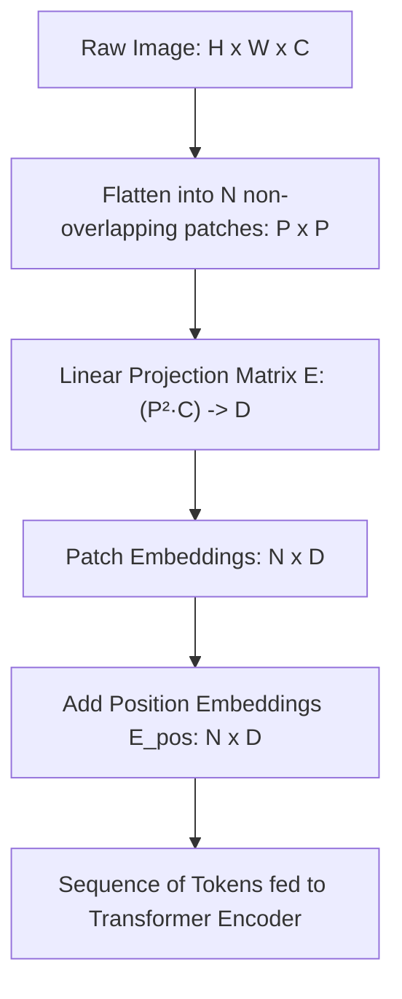
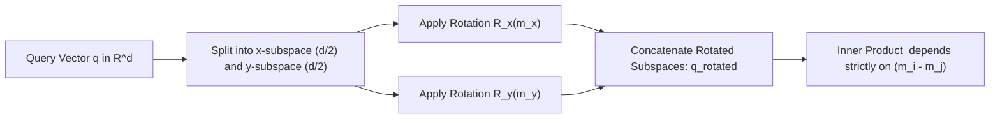
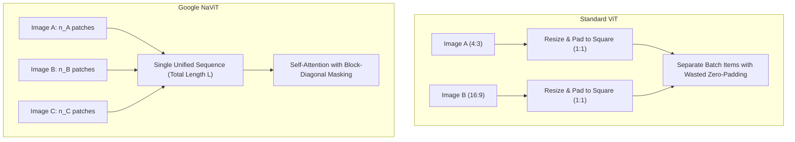
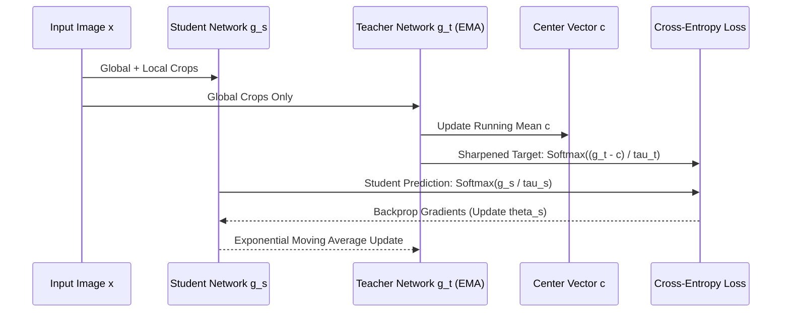
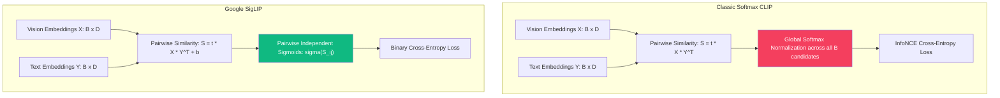
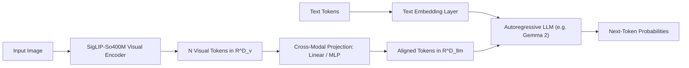

# The Math behind Foundational Vision Models

Modern vision models look very different from classical convolutional networks. Instead of baking spatial locality and translation equivariance directly into sliding kernels, models like ViT, DINOv2, SigLIP, NaViT, and PaliGemma 2 rely on sequence tokenization, self-supervised objectives, and contrastive or autoregressive loss formulations.

This post covers the mathematical formulation behind these architectures: patch projection geometry, 2D rotary position embeddings, the dynamics of self-distillation collapse prevention, and how SigLIP replaces softmax normalizers with pairwise sigmoid loss to scale contrastive batches.

---

## 1. Spatial tokenization: patch projection geometry

A standard 2D convolution assumes that nearby pixels have stronger statistical dependencies than distant pixels (locality) and that patterns appear identically across spatial shifts (translation equivariance). Vision Transformers drop both structural constraints from the layer definition. The network learns spatial correlations directly from training data.

### The linear projection equation

Take an input image $\mathbf{X} \in \mathbb{R}^{H \times W \times C}$, where $H$ is height, $W$ is width, and $C$ is channel depth (3 for standard RGB):

1. The image is split into non-overlapping patches of spatial dimension $P \times P$.
2. The sequence length $N$ (the number of patch tokens) is:

$$N = \frac{H \cdot W}{P^2}$$

3. Each patch $\mathbf{x}_p^{(i)}$ is flattened into a 1D vector of dimension $P^2 \cdot C$:

$$\mathbf{x}_p^{(i)} \in \mathbb{R}^{P^2 \cdot C}, \quad i \in \{1, \dots, N\}$$

4. The flattened vector maps into hidden dimension $D$ through a projection matrix $\mathbf{E} \in \mathbb{R}^{(P^2 \cdot C) \times D}$ and optional bias $\mathbf{b}_e \in \mathbb{R}^D$:

$$\mathbf{z}_0 = \left[ \mathbf{x}_{\text{class}}; \ \mathbf{x}_p^{(1)}\mathbf{E}; \ \mathbf{x}_p^{(2)}\mathbf{E}; \ \dots; \ \mathbf{x}_p^{(N)}\mathbf{E} \right] + \mathbf{E}_{\text{pos}}$$

Here $\mathbf{x}_{\text{class}} \in \mathbb{R}^D$ is the prepended learnable `[CLS]` token, and $\mathbf{E}_{\text{pos}} \in \mathbb{R}^{(N + 1) \times D}$ is the positional encoding matrix.

### Computational complexity and the quadratic bottleneck

In multi-head self-attention (MHSA), queries $\mathbf{Q}$, keys $\mathbf{K}$, and values $\mathbf{V}$ come from projection matrices $\mathbf{W}_Q, \mathbf{W}_K, \mathbf{W}_V \in \mathbb{R}^{D \times D}$:

$$\mathbf{Q} = \mathbf{Z} \mathbf{W}_Q, \quad \mathbf{K} = \mathbf{Z} \mathbf{W}_K, \quad \mathbf{V} = \mathbf{Z} \mathbf{W}_V$$

The attention equation is:

$$\text{Attention}(\mathbf{Q}, \mathbf{K}, \mathbf{V}) = \text{softmax}\left( \frac{\mathbf{Q}\mathbf{K}^\top}{\sqrt{d_k}} \right) \mathbf{V}$$

For sequence length $N$ and hidden dimension $D$, the FLOP cost per layer breaks down as follows:

* Projections for $\mathbf{Q}, \mathbf{K}, \mathbf{V}$ require $3 \times (2 N D^2) = 6 N D^2$ floating point operations.
* The attention matrix product $\mathbf{Q}\mathbf{K}^\top$ multiplies $(N \times D)$ by $(D \times N)$, costing $2 N^2 D$ FLOPs.
* Softmax scaling requires roughly $3 N^2$ operations.
* Multiplying attention weights by values, $\mathbf{A}\mathbf{V}$, costs $2 N^2 D$ FLOPs.
* The final output projection adds $2 N D^2$ FLOPs.

Summing these terms gives the per-layer cost:

$$\text{FLOPs}_{\text{layer}} \approx 8 N D^2 + 4 N^2 D$$

Because $N = \frac{HW}{P^2}$, halving the patch size from $P=16$ to $P=8$ quadruples $N$. The $4 N^2 D$ attention term and training activation memory both increase by a factor of 16. For this reason, architectures like ViT-H and SigLIP keep $P=14$ or $P=16$ during pre-training, reserving smaller patch sizes like $P=8$ for fine-tuning.

---

## 2. 2D positional geometry: learned embeddings vs 2D-RoPE

In language models, tokens follow a 1D sequence index. In vision, flattening a 2D grid into a 1D sequence separates vertically adjacent patches: patch $(i, j)$ and patch $(i+1, j)$ end up separated by an offset of $W/P$ tokens in the sequence.

### 1D learned embeddings and bicubic interpolation

Standard ViT adds learned 1D vectors $\mathbf{e}_i \in \mathbb{R}^D$ to input tokens. When input resolution increases during fine-tuning (for example, moving from $224 \times 224$ to $448 \times 448$), the sequence length expands from 196 to 784 tokens.

To adapt pre-trained positional embeddings to the larger grid, ViT applies 2D bicubic spline interpolation:

$$\mathbf{E}_{\text{pos}}^{2D}(x, y) = \sum_{k=0}^3 \sum_{l=0}^3 a_{k, l} \, x^k y^l$$

This interpolation fits new coordinates to the learned grid, but the representation remains tied to absolute coordinates rather than relative spatial distance.

### 2D rotary position embeddings (2D-RoPE)

Modern backbones adapt Rotary Position Embeddings (RoPE) to two dimensions. Instead of adding vectors to token inputs, 2D-RoPE rotates query and key vectors in the complex plane based on their 2D coordinates $(m_x, m_y)$.

For head dimension $d$, the channel space splits into two equal parts of size $d/2$: one for the horizontal axis $x$, and one for the vertical axis $y$.

For coordinate $(m_x, m_y)$, the 2D rotary operator $\mathbf{R}_{(m_x, m_y)}$ forms a block-diagonal matrix:

$$\mathbf{R}_{(m_x, m_y)} = \begin{pmatrix} \mathbf{R}_{m_x} & \mathbf{0} \\ \mathbf{0} & \mathbf{R}_{m_y} \end{pmatrix}$$

Each sub-matrix $\mathbf{R}_{m}$ rotates consecutive coordinate pairs by angle $m \theta_k$:

$$\mathbf{R}_m^{(k)} = \begin{pmatrix} \cos(m \theta_k) & -\sin(m \theta_k) \\ \sin(m \theta_k) & \cos(m \theta_k) \end{pmatrix}, \quad \theta_k = 10000^{-2(k-1)/d_s}$$

Evaluating attention between query $\mathbf{q}$ at position $\mathbf{u} = (u_x, u_y)$ and key $\mathbf{k}$ at position $\mathbf{v} = (v_x, v_y)$ yields:

$$\langle \mathbf{R}_{\mathbf{u}} \mathbf{q}, \ \mathbf{R}_{\mathbf{v}} \mathbf{k} \rangle = (\mathbf{R}_{\mathbf{u}} \mathbf{q})^\top (\mathbf{R}_{\mathbf{v}} \mathbf{k}) = \mathbf{q}^\top \mathbf{R}_{\mathbf{u}}^\top \mathbf{R}_{\mathbf{v}} \mathbf{k} = \mathbf{q}^\top \mathbf{R}_{\mathbf{u} - \mathbf{v}} \mathbf{k}$$

Because 2D rotation matrices belong to the orthogonal group $\text{SO}(2)$ where $\mathbf{R}_\mathbf{u}^\top \mathbf{R}_\mathbf{v} = \mathbf{R}_{\mathbf{u} - \mathbf{v}}$, the inner product depends strictly on the spatial offset vector:

$$\Delta \mathbf{p} = (u_x - v_x, \ u_y - v_y)$$

The attention operation retains translation equivariance across the 2D plane regardless of input image dimensions.

---

## 3. Google's NaViT: Patch 'n' Pack and arbitrary aspect ratios

Standard vision models process square inputs ($224 \times 224$ or $384 \times 384$). Non-square inputs either get resized, which distorts object aspect ratios, or padded with zeros, which wastes attention operations on empty space.

Google Research designed NaViT (Native Resolution ViT) around an approach called Patch 'n' Pack, which processes variable aspect ratios without padding.

### The Patch 'n' Pack formulation

Instead of allocating one image per batch index, multiple images $I_1, I_2, \dots, I_K$ with patch counts $n_1, n_2, \dots, n_K$ are packed into a single sequence buffer of length $L$:

$$\sum_{k=1}^K n_k \le L$$

Each patch token receives continuous 2D coordinates $(x_i, y_i) \in [0, 1]^2$, normalized to the original image dimensions:

$$x_i = \frac{c_i \cdot P}{W_{\text{orig}}}, \quad y_i = \frac{r_i \cdot P}{H_{\text{orig}}}$$

To prevent tokens from different images attending to each other within the shared sequence, the attention matrix applies an indicator mask:

$$\mathbf{A}_{i, j} = \begin{cases} \frac{\mathbf{q}_i^\top \mathbf{k}_j}{\sqrt{d_k}} & \text{if } \text{img\_id}(i) = \text{img\_id}(j) \\ -\infty & \text{if } \text{img\_id}(i) \neq \text{img\_id}(j) \end{cases}$$

This structure produces a block-diagonal attention map. Because self-attention is permutation-equivariant up to position encodings, the network processes different images and aspect ratios concurrently in a single forward pass.

---

## 4. Self-supervised distillation: DINOv2 and collapse prevention

Supervised training optimizes for discrete class labels, which discards fine spatial details. Self-supervised distillation learns dense visual representations directly from data without human annotation. DINOv2 uses student-teacher distillation with explicit mechanisms to prevent representation collapse.

### Student-teacher distillation

DINOv2 feeds different augmented views of an image to two networks:

* Student network $g_{\theta_s}$: processes global and local crops, parameterized by weights $\theta_s$.
* Teacher network $g_{\theta_t}$: processes global crops only, parameterized by weights $\theta_t$.

Teacher weights do not receive gradients. They update using an Exponential Moving Average (EMA) of the student weights:

$$\theta_t \leftarrow \lambda \theta_t + (1 - \lambda) \theta_s, \quad \lambda \in [0.996, 1.0]$$

Each network projects features into a $K$-dimensional probability distribution using temperature-scaled softmax:

$$P_s(x)^{(k)} = \frac{\exp\left( g_{\theta_s}(x)^{(k)} / \tau_s \right)}{\sum_{j=1}^K \exp\left( g_{\theta_s}(x)^{(j)} / \tau_s \right)}$$

$$P_t(x)^{(k)} = \frac{\exp\left( (g_{\theta_t}(x)^{(k)} - c^{(k)}) / \tau_t \right)}{\sum_{j=1}^K \exp\left( (g_{\theta_t}(x)^{(j)} - c^{(j)}) / \tau_t \right)}$$

Here $\tau_s$ and $\tau_t$ are temperature parameters, and $\mathbf{c} \in \mathbb{R}^K$ is a dynamic centering vector.

The objective minimizes cross-entropy between the student prediction and the teacher distribution:

$$\mathcal{L}_{\text{DINO}} = - \sum_{k=1}^K P_t(x)^{(k)} \log P_s(x)^{(k)}$$

### Centering and sharpening mechanics

Without negative pairs, self-distillation can collapse in two ways:

1. Uniform collapse: the distribution becomes completely flat across all outputs.
2. One-hot collapse: the model outputs 100% probability on a single dimension regardless of input.

DINOv2 balances these tendencies with centering and sharpening:

Subtracting the running mean $\mathbf{c}$ prevents any single coordinate from dominating:

$$\mathbf{c} \leftarrow m \mathbf{c} + (1 - m) \frac{1}{B} \sum_{i=1}^B g_{\theta_t}(x_i)$$

If dimension $k$ activates frequently across a batch, $c^{(k)}$ increases, subtracting value from that logit in subsequent iterations.

Setting $\tau_t < \tau_s$ (for example, $\tau_t = 0.04$ and $\tau_s = 0.1$) sharpens the teacher output distribution, preventing the logits from decaying toward a uniform vector.

### The KoLeo regularizer

To keep patch embeddings distributed across the representation manifold, DINOv2 uses the Kozachenko-Leonenko (KoLeo) differential entropy estimator.

For normalized feature vectors $\{\mathbf{z}_1, \dots, \mathbf{z}_n\}$, the KoLeo loss maximizes the Euclidean distance between each vector and its nearest distinct neighbor:

$$\mathcal{L}_{\text{KoLeo}} = - \frac{1}{n} \sum_{i=1}^n \log \left( \min_{j \neq i} \| \mathbf{z}_i - \mathbf{z}_j \|_2 \right)$$

The gradient with respect to sample $\mathbf{z}_i$ and its nearest neighbor $\mathbf{z}_{n(i)}$ is:

$$\frac{\partial \mathcal{L}_{\text{KoLeo}}}{\partial \mathbf{z}_i} = - \frac{1}{n} \frac{\mathbf{z}_i - \mathbf{z}_{n(i)}}{\| \mathbf{z}_i - \mathbf{z}_{n(i)} \|_2^2}$$

As two vectors draw closer together, $\| \mathbf{z}_i - \mathbf{z}_{n(i)} \|_2 \to 0$, the gradient magnitude increases inversely with squared distance, repelling duplicate representations across the unit sphere $\mathbb{S}^{D-1}$.

---

## 5. Contrastive objectives: classic CLIP vs Google SigLIP

Contrastive pre-training maps image and text representations into a shared vector space.

### Classic CLIP and InfoNCE loss

For normalized image representations $\mathbf{X} \in \mathbb{R}^{B \times D}$ and text representations $\mathbf{Y} \in \mathbb{R}^{B \times D}$ with similarity $S_{i, j} = \mathbf{x}_i^\top \mathbf{y}_j$ and temperature $t = \exp(\tau)$:

The InfoNCE loss treats diagonal pairs $(i, i)$ as positives and off-diagonal pairs $(i, j)$ ($j \neq i$) as negatives:

$$\mathcal{L}_{\text{image}\to\text{text}} = - \frac{1}{B} \sum_{i=1}^B \log \frac{\exp(t \cdot \mathbf{x}_i^\top \mathbf{y}_i)}{\sum_{j=1}^B \exp(t \cdot \mathbf{x}_i^\top \mathbf{y}_j)}$$

$$\mathcal{L}_{\text{text}\to\text{image}} = - \frac{1}{B} \sum_{i=1}^B \log \frac{\exp(t \cdot \mathbf{y}_i^\top \mathbf{x}_i)}{\sum_{j=1}^B \exp(t \cdot \mathbf{y}_j^\top \mathbf{x}_i)}$$

$$\mathcal{L}_{\text{CLIP}} = \frac{1}{2} \left( \mathcal{L}_{\text{image}\to\text{text}} + \mathcal{L}_{\text{text}\to\text{image}} \right)$$

The denominator $\sum_{j=1}^B \exp(t \cdot \mathbf{x}_i^\top \mathbf{y}_j)$ introduces a global normalizer over all $B$ items. In distributed training:

* All GPU ranks must collect text embeddings from every other rank via an `AllGather` collective before evaluating the denominator.
* Two identical concepts in the same batch act as false negatives, penalizing valid representations.
* Computing the full $(B \times B)$ matrix requires $O(B^2)$ memory on a single rank, which caps practical batch sizes around 32,768 to 65,536 items.

### Google SigLIP: pairwise sigmoid loss

In 2023, Google DeepMind (Zhai et al.) replaced the softmax normalizer with independent binary logistic regressions for each pair in the batch.

Each cell $(i, j)$ in the similarity matrix is treated as a separate binary classification problem:

* $z_{i, j} = 1$ when $i = j$ (matching pair)
* $z_{i, j} = -1$ when $i \neq j$ (non-matching pair)

The SigLIP loss function is:

$$\mathcal{L}_{\text{SigLIP}} = - \frac{1}{|B|} \sum_{i=1}^{|B|} \sum_{j=1}^{|B|} \log \sigma \left( z_{i, j} \cdot (t \cdot \mathbf{x}_i^\top \mathbf{y}_j + b) \right)$$

Here $\sigma(z) = \frac{1}{1 + e^{-z}}$, $t$ is a learnable temperature, and $b$ is a learnable scalar bias.

Writing out positive and negative terms explicitly:

$$\mathcal{L}_{\text{SigLIP}} = - \frac{1}{|B|} \sum_{i=1}^{|B|} \left[ \log \sigma(t \cdot \mathbf{x}_i^\top \mathbf{y}_i + b) + \sum_{j \neq i} \log \sigma(- (t \cdot \mathbf{x}_i^\top \mathbf{y}_j + b)) \right]$$

Applying $\log \sigma(-u) = -u - \log(1 + e^{-u})$ yields:

$$\mathcal{L}_{\text{SigLIP}} = \frac{1}{|B|} \sum_{i=1}^{|B|} \left[ \log(1 + e^{-(t \mathbf{x}_i^\top \mathbf{y}_i + b)}) + \sum_{j \neq i} \log(1 + e^{t \mathbf{x}_i^\top \mathbf{y}_j + b}) \right]$$

### Computational properties of the sigmoid loss

1. No global partition function: because the loss sums independent pairwise terms, devices do not need to gather the entire batch before loss computation.
2. Chunked evaluation: similarity calculations can run block by block in memory, reducing the memory requirement from $O(B^2)$ to $O(B_{\text{local}} \cdot B_{\text{chunk}})$.
3. Batch scalability: without a competitive softmax denominator, batch sizes can scale past 1,000,000 samples without gradient instability.
4. Bias parameter $b$: negative pairs outnumber positive pairs by $B^2 - B$ to $B$. Without offset $b$, negative gradients dominate training. Initializing $b$ to approximately $-10$ sets the baseline prior probability $\sigma(b) \approx 0.000045$, matching the low proportion of positive pairs in large batches.

---

## 6. Multimodal projection: PaliGemma 2 and cross-modal adapters

Vision-language models map visual representations into the token space of an autoregressive language model.

### Projection methods

To pass visual features $\mathbf{Z}_v \in \mathbb{R}^{N \times D_v}$ into language embedding space $\mathbb{R}^{N \times D_{\text{llm}}}$, models use one of three common projection layers:

1. Linear projection (PaliGemma style):

$$\mathbf{H}_v = \mathbf{Z}_v \mathbf{W}_{\text{proj}} + \mathbf{b}_{\text{proj}}, \quad \mathbf{W}_{\text{proj}} \in \mathbb{R}^{D_v \times D_{\text{llm}}}$$

When the visual backbone (such as SigLIP-So400M) is pre-trained with contrastive alignment, a single linear map preserves spatial positions while projecting feature dimensions.

2. Two-layer MLP (LLaVA style):

$$\mathbf{H}_v = \text{GELU}(\mathbf{Z}_v \mathbf{W}_1 + \mathbf{b}_1) \mathbf{W}_2 + \mathbf{b}_2$$

3. Perceiver query resampler (Flamingo and PaLI):

At higher resolutions ($896 \times 896$), an image produces $64 \times 64 = 4096$ patch tokens. To reduce sequence length before the language model, $M$ learnable query tokens $\mathbf{Q}_{\text{learn}} \in \mathbb{R}^{M \times D_{\text{llm}}}$ ($M \ll N$, such as $M = 64$) extract compressed features through cross-attention:

$$\mathbf{H}_v = \text{softmax}\left( \frac{(\mathbf{Q}_{\text{learn}} \mathbf{W}_Q)(\mathbf{Z}_v \mathbf{W}_K)^\top}{\sqrt{d}} \right) (\mathbf{Z}_v \mathbf{W}_V)$$

### The autoregressive training objective

Visual tokens $\mathbf{H}_v$ and text prompt tokens $\mathbf{H}_t$ concatenate into a single sequence:

$$\mathbf{S} = [\mathbf{h}_1^v, \dots, \mathbf{h}_M^v, \ \mathbf{h}_1^t, \dots, \mathbf{h}_K^t]$$

The model trains by minimizing cross-entropy over target text tokens:

$$\mathcal{L}_{\text{VLM}}(\theta) = - \sum_{i=1}^{T} \log \left( \frac{\exp(\mathbf{w}_{y_i}^\top \mathbf{u}_i)}{\sum_{w \in \mathcal{V}} \exp(\mathbf{w}_w^\top \mathbf{u}_i)} \right)$$

where $\mathbf{u}_i$ is the decoder hidden state at step $i$ and $\mathcal{V}$ is the vocabulary.

---

## 7. Architecture comparison

| Model | Positional Encoding | Objective Function | Scaling Advantage | Tradeoff |
| :--- | :--- | :--- | :--- | :--- |
| **Vanilla ViT** (Dosovitskiy et al.) | 1D learned embeddings | Softmax Cross-Entropy | Direct transformer transfer to image patches | Quadratic self-attention complexity $O(N^2)$ |
| **DINOv2** (Oquab et al.) | Patch + `[CLS]`, 2D interpolation | Student-Teacher distillation + KoLeo regularizer | Dense feature maps without manual labels | Requires training two networks with EMA synchronization |
| **Classic CLIP** (Radford et al.) | 1D learned embeddings | Symmetric InfoNCE Loss | Unified multimodal vector space | $O(B^2)$ memory and `AllGather` communication bottlenecks |
| **SigLIP** (Google DeepMind) | 2D learned embeddings | Pairwise Sigmoid Loss | Decoupled normalizer, batch scaling past $1\text{M}$ | Requires tuning initial bias $b$ and temperature $t$ |
| **NaViT** (Google Research) | Continuous coordinates $(x, y) \in [0, 1]^2$ | Contrastive or Masked Autoencoding | Native aspect ratios without zero-padding | Requires sequence packing logic and masked attention |
| **PaliGemma 2** (Google) | SigLIP-So400M backbone | Autoregressive Next-Token Cross-Entropy | Stable spatial grounding with linear projection | Linear adapter restricts projection capacity |

---

## Practical takeaways

Linear patch projection converts continuous spatial images into sequence tokens, where computational complexity scales as $O(N^2) = O\left(\left(\frac{HW}{P^2}\right)^2\right)$. Replacing 1D positional vectors with 2D rotary rotations maintains relative displacement across variable grid resolutions. In self-supervised distillation, balancing centering and sharpening prevents mode and uniform collapse without negative samples. At the contrastive level, replacing global softmax normalizers with pairwise sigmoid loss eliminates all-to-all communication barriers, allowing distributed vision pre-training to scale to arbitrarily large batch sizes.
